# Le Recyclage Plastique

## Importance du recyclage plastique

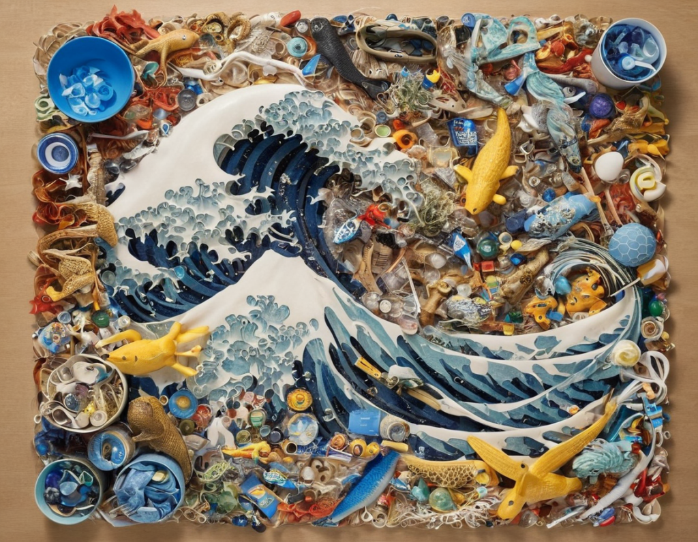

Le recyclage du plastique est le retraitement des déchets plastiques en produits nouveaux et utiles. Lorsqu'elle est effectuée correctement, cela peut réduire la dépendance à l'enfouissement, préserver les ressources naturelles et protéger l'environnement de la pollution plastique.

**Vers un triplement de la consommation d'ici 2060 !**

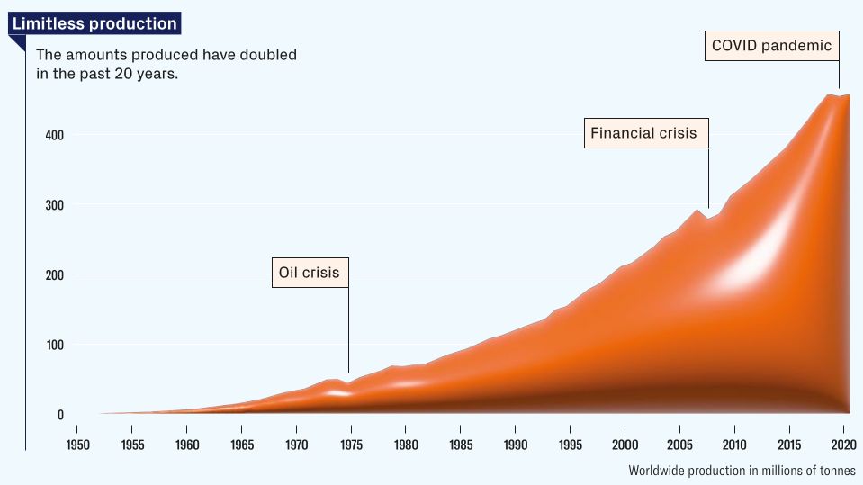

Source : [Plastic-The Worlds-Growing-Addiction](https://my.volkseco.ch/index.php/s/twWKZ22efexTjiZ) (SWISSQUOTE 2023)

Chaque année dans le monde les déchets plastiques représentent plus de 245 Mégatonnes, seuls 16% sont recyclés, 22% sont incinérés avec valorisation énergétique et 62% sont enfouis et incinérés sans valorisation énergétique.  
Source : wikipedia (2010)

**Pourquoi nous utilisons le plastique**

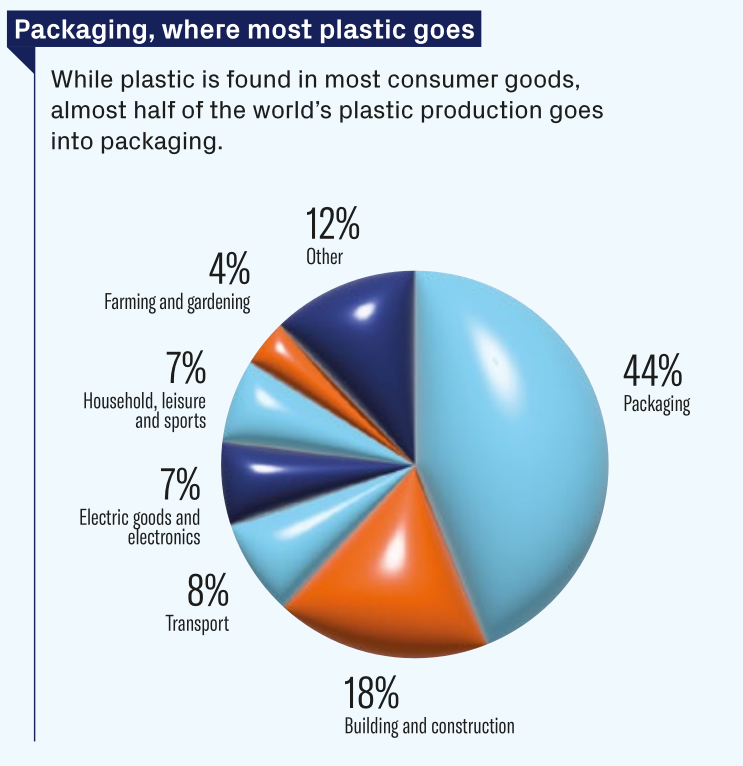

Source : [Plastic-The Worlds-Growing-Addiction](https://my.volkseco.ch/index.php/s/twWKZ22efexTjiZ) (SWISSQUOTE 2023)

La consommation de plastique continue d'augmenter de manière alarmante, alimentée par la compétition accrue dans la production de biens, l'essor de l'Internet des objets (IoT) et l'émergence des pays en voie de développement, ce qui rend peu probable une diminution de cette tendance dans un avenir proche.

**La part de plastiques recyclés dans la production totale de plastique est très faible.**

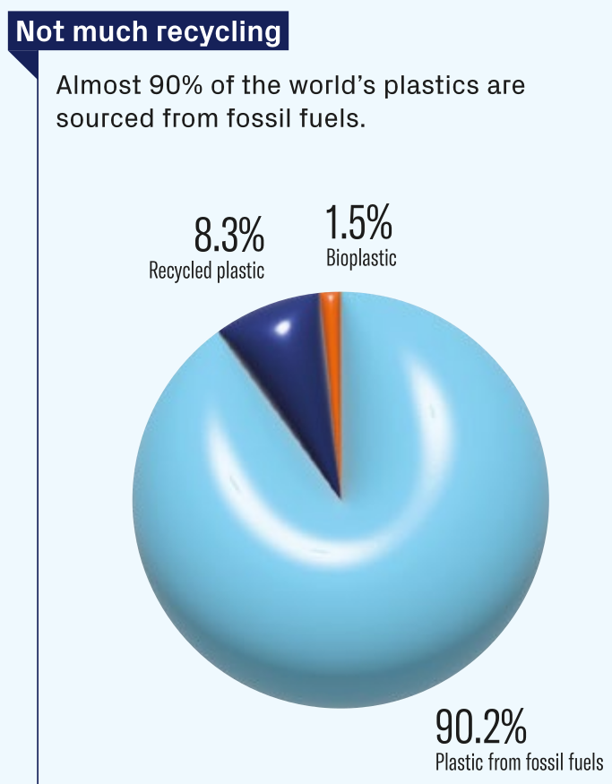

Le recyclage du plastique sans utilisation d’électricité est possible grâce à l’énergie solaire thermique et aux machines manuelles. 

**Dans ce support nous présentons les différents plastiques ainsi que le processus et matériel nécessaire pour réaliser le recyclage plastique sans utilisation d’électricité, complètement Off-Gridd.**

## Recyclage plastique standard

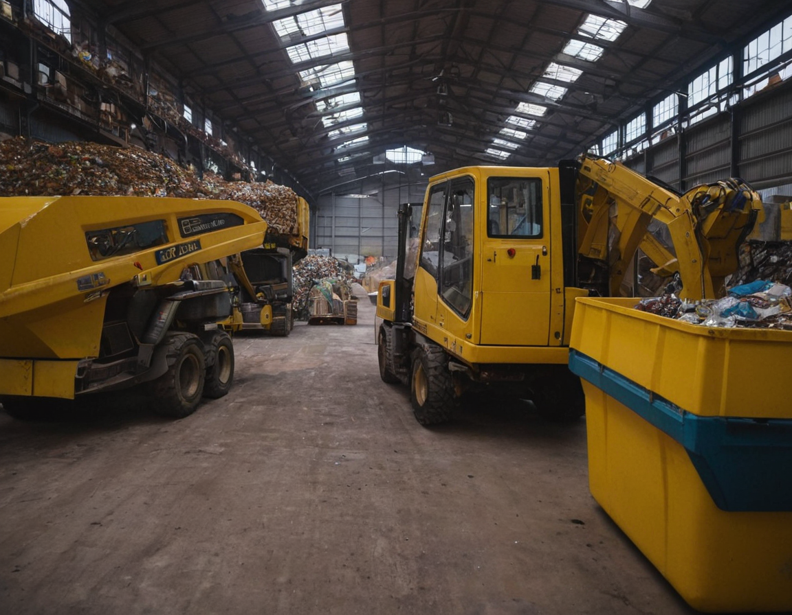

Le recyclage du plastique standard nécessite plusieurs étapes pour être efficace. 

**Nous pouvons séparer le recyclage en 6 étapes :** 

1. **Collecte** 🛍️🚲🏭  
   La première étape du processus de recyclage est la collecte des matériaux post-consommation. Cela peut être fait par les consommateurs avec des points de collecte ou par des entreprises privées.
2. **Catégorisation** 🔤🎨📦  
   Les différents types de plastique doivent être séparés et triés par propriétés et par couleur. Cette étape est importante pour augmenter l'efficacité et éviter la contamination des produits finaux.
3. **Lavage \[Électrique\]** 🧼🧽💧  
   Le lavage est crucial pour le recyclage du plastique, éliminant ainsi les impuretés qui peuvent gêner l'opération. Les étiquettes et les adhésifs des produits, ainsi que la saleté et les résidus alimentaires sont les principales impuretés.
4. **Séparation des plastiques \[Électrique\]** ⚖️📂  
   Il existe plusieurs types de plastique (voir ci-dessus), qui doivent être séparés les uns des autres. De plus, les plastiques peuvent être triés selon d'autres propriétés telles que la couleur. Ceci est fait par des machines à l'usine de recyclage. 
5. **Broyage \[Électrique\]** 🔨🛠️⚙️  
   Le plastique est introduit dans des broyeurs qui le décomposent en morceaux. Ceux-ci peuvent être utilisés pour d'autres applications sans autre traitement, comme	un additif dans l'asphalte ou simplement vendus comme matière première.
6. **Mise en forme \[Électrique\]** 🔥🏭🖌️  
   Cette dernière étape du processus de recyclage du plastique est l'endroit où les plastiques broyés sont transformés en un produit utilisable. Le plastique est fondu et injecté dans des moules pour la forme finale ou extrudé pour obtenir des profilés.

   Dans le processus de recyclage de plastique standard, certaines étapes nécessitent des machines électriques, ce qui vous rend dépendant du réseau. De plus, la fonte du plastique pour injection est très énergivore.

**La façon la plus écologique de recycler le plastique.**

## Recyclage de plastique Solaire Off-Grid

Le processus de recyclage solaire du plastique est le moyen le plus écologique de recycler le plastique. Le processus Sun Factory ne nécessite pas d'électricité.

1. **Collecte** 🛍️🚲🏭  
   La collecte des matériaux post-consommation peut être faite par les ménages ou par des entreprises privées. Nous suggérons d'utiliser des plastiques ménagers ou des jetables industriels qui sont relativement plus propres et accessibles.
2. **Catégorisation** 🔤🎨📦  
   Les différents types de plastique doivent être séparés. Cette étape est importante pour augmenter l'efficacité et éviter la contamination des produits finaux. Avec l’énergie thermique solaire sont recyclables les types PLA, PP, HDPE et LDPE.
3. **Lavage \[Manuel\]** 🧼🧽💧  
   Les étiquettes et les adhésifs des produits, la saleté et les résidus alimentaires sont les principales impuretés.   
   Pour augmenter l'impact écologique du processus, il convient de laver les objets avec de l'eau de pluie et manuellement.
4. **Déchiquetage \[Manuel\]** 🔨🛠️⚙️  
   Le plastique est introduit dans des broyeurs manuels qui le décomposent en miettes.  
   Ceux-ci peuvent être vendus comme matière première et utilisés pour l'injection de nouvelles formes. Il est important de les déchiqueter séparément par type.  
   Le processus Sun Factory est également réalisable sans l'utilisation de broyeur, découpant les plastique manuellement en morceaux pouvant entrer dans les cartouches d'injection.
5. **Stockage des plastiques \[Manuel\]** ⚖️📂  
   Les différents types de plastique (ci-dessus) doivent être stockés séparément les uns des autres. Pour un bon stockage, les types et les couleurs de plastique doivent être séparés avant le déchiquetage (4).
6. **Fonte du plastique  \[Solaire + Manuel\]** 🔥☀️🛠️🧤  
   Pour faire fondre le plastique, celui-ci est mis dans des cartouches métalliques puis chauffé à l'aide d'un concentrateur solaire pouvant atteindre 300°C.   
   La température du plastique doit être surveillée avec une sonde électronique.
7. **Injection \[Manuelle\]** 🖐️🛠️  
   Le plastique fondu est transféré de la cartouche dans le moule par une presse manuelle, donnant au plastique recyclé une  nouvelle forme.

## Recyclage de plastiques solaire vs standard

| Étape                 | Recyclage standard             | Recyclage solaire (off-grid)                       |
|-----------------------|--------------------------------|----------------------------------------------------|
| Collecte              | Tous types collectés           | Tous types collectés, **non-injectables au réseau**    |
| Catégorisation        | Tri des plastiques             | Tri + mise en forme possible (PLA, PP, HDPE, LDPE) |
| Lavage                | Machine / quantités modérées   | **Manuel** / **quantités adaptées**                        |
| Déchiquetage          | **Broyeur électrique**             | **Kutters**, ciseaux, sac & marteau pour concasser     |
| Stockage              | Contenants standards           | **Contenants fermés si en extérieur**                  |
| Fonte & mise en forme | Injection électrique classique | Cartouches métalliques + **injection manuelle**        |

  
La principale différence réside dans le caractère autonome du recyclage solaire, fonctionnant hors réseau électrique et sans recours à l’électricité conventionnelle.

# Les plastiques

## Origine des plastiques

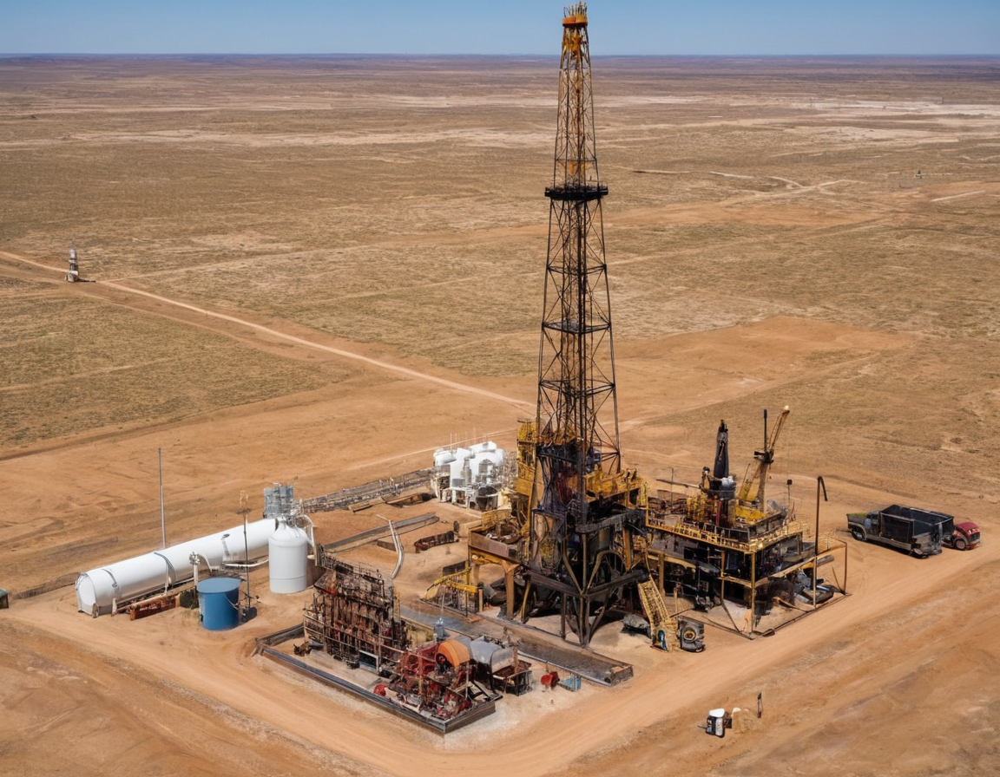

Les plastiques proviennent du **pétrole** et du **gaz naturel :**

- Extraction de pétrole
- Raffinage
- Obtention de **nafta** (fraction pétrolière légère).

Le **nafta** est un liquide clair obtenu à partir du **raffinage du pétrole brut**. Il contient des **molécules légères** qui servent de **matière première pour fabriquer des plastiques**. On peut le comparer à une “soupe chimique” de petites molécules prêtes à être transformées en plastiques comme le polyéthylène ou le polystyrène.

- La **nafta** est transformée en **monomères** 
  - Petites molécules composées essentiellement de carbone et hydrogène.
  - Les monomères sont assemblés par **polymérisation** pour former des **polymères**
    - Macromolécules
    - Plastiques

## Types de plastiques communs

| Type                                  | Symbole | Formule              | Caractéristiques                                                |
|---------------------------------------|---------|----------------------|-----------------------------------------------------------------|
| Polyéthylène (PE)                     | 2       | \-(CH₂-CH₂)-ₙ         | Léger, flexible, résistant à l’eau, flotte, cassable sous force |
| Polyéthylène haute densité (HDPE)     | 2       | \-(CH₂-CH₂)-ₙ         | Rigide, résistant aux chocs, flotte                             |
| Polyéthylène basse densité (LDPE)     | 4       | \-(CH₂-CH₂)-ₙ         | Souple, transparent, flexible, flotte                           |
| Polypropylène (PP)                    | 5       | \-(C₃H₆)-ₙ            | Rigide, résistant à la chaleur, flotte, cassable                |
| Polystyrène (PS)                      | 6       | \-(C₈H₈)-ₙ            | Rigide, cassant, isolant thermique, peut couler selon densité   |
| Acrylonitrile butadiène styrène (ABS) | 7       | \-(C₈H₈·C₄H₆·C₃H₃N)-ₙ | Dur, résistant aux chocs, ne flotte pas, cassable               |
| Polyéthylène téréphtalate (PET)       | 7       | \-(C₁₀H₈O₄)-ₙ         | Transparent, rigide, utilisé pour bouteilles, coule dans l’eau  |

**Propriétés générales :**

- **Identification :** symbole de recyclage, transparence, couleur, rigidité.
- **Dureté :** certains plastiques se brisent facilement (PS, ABS), d’autres sont flexibles (PE, LDPE).
- **Flottaison :** PE et PP flottent, PET et PVC coulent.

**Utilisations :** emballages, bouteilles, tuyaux, pièces industrielles, jouets, isolants.

## Températures et compatibilité solaire

Voici un aperçu des principaux types de plastiques et de leur compatibilité avec le recyclage standard et le recyclage solaire.

| Plastique | Fusion (°C) | Recyclable | Recyclable solaire |
|-----------|-------------|------------|--------------------|
| LDPE      | 105–115     | ✅ Oui      | ✅ Oui              |
| HDPE      | 130–135     | ✅ Oui      | ✅ Oui              |
| PP        | 160–170     | ✅ Oui      | ✅ Oui              |
| PS        | 90–100      | ✅ Oui      | ✅ Oui              |
| ABS       | 210–250     | ✅ Oui      | ⚠️ À peine         |
| PET       | 250–260     | ✅ Oui      | ❌ Non              |
| PVC       | 160–210     | ✅ Oui      | ⚠️ (Danger)        |
| PC        | 260–270     | ✅ Oui      | ❌ Non              |
| PLA       | 150–160     | ✅ Oui      | ✅ Oui              |

Le recyclage solaire est efficace pour les plastiques fondant **≤ 220 °C**, tandis que les plastiques à fusion plus élevée nécessitent d’autres méthodes ou ne peuvent pas être recyclés hors réseau.

⚠️ Attention : le PVC peut libérer des gaz toxiques lorsqu’il est chauffé, il n'est pas conseillé de faire du recyclage de PVC autrement que le processus industriel.

L’un des avantages du recyclage solaire est que le processus se fait en plein air, réduisant ainsi les risques d’inhalation et de concentration de vapeurs dangereuses.

# Mise en œuvre pratique

## Matériel nécessaire

Dans un conteneur adapté aux transports des outils et aux opérations de transformation des déchets plastiques, les objets sont disposés selon les différentes étapes de la transformation.

| Étape                                 |         | Équipements                                                                                         |
|---------------------------------------|---------|-----------------------------------------------------------------------------------------------------|
| **Collecte**                              | 🛍️🚲🚌 | Sacs / caisses, vélos, transport en commun, réseau périodique                                       |
| **Lavage (manuel)**                       | 🧼🧽    | Bassine, éponges, spatules                                                                          |
| **Catégorisation**                        | 🔤♴♷♸   | Liste des symboles plastiques, bacs étanches                                                        |
| **Déchiquetage (manuel)**                 | ✂️🔪🛠️ | Kutters, ciseaux, sac et marteau pour concasser                                                     |
| **Stockage (manuel)**                     | 🗄️📦   | Étagères, boîtes fermées et étiquetées, suivi des quantités (g)                                     |
| **Fonte du plastique (manuel + solaire)** | 🔥☀️    | Entonnoir, concentrateur solaire thermique, gants, cartouche témoin avec sonde digitale             |
| **Injection (manuel)**                    | 🏭🛠️   | Moule d’injection, presse, clés de serrage, outils de démoulage, caisses de stockage produits finis |

## Machines clé

### **Concentrateur solaire à tubes sous vide (fixe)**

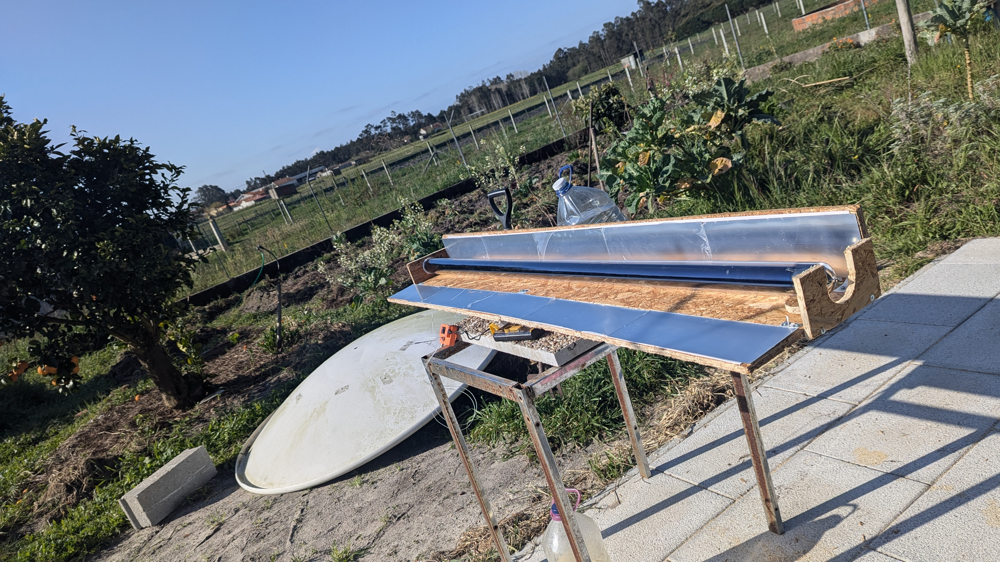

Un concentrateur solaire à tubes sous vide est un dispositif fixe qui capte l'énergie solaire pour la convertir en chaleur. Il est constitué de plusieurs tubes en verre sous vide, chacun contenant un absorbeur thermique. Cette configuration permet d'atteindre des températures élevées, idéales pour la fusion des plastiques.

Guide détaillé :  <https://hub.antenna.ch/node/114>

---

### **Concentrateur solaire portable simple**

Ce concentrateur est une version mobile et simplifiée, adaptée aux applications de recyclage solaire à petite échelle. 

Guide détaillé : <https://hub.antenna.ch/node/90>

---

### **Injecteuse manuelle**

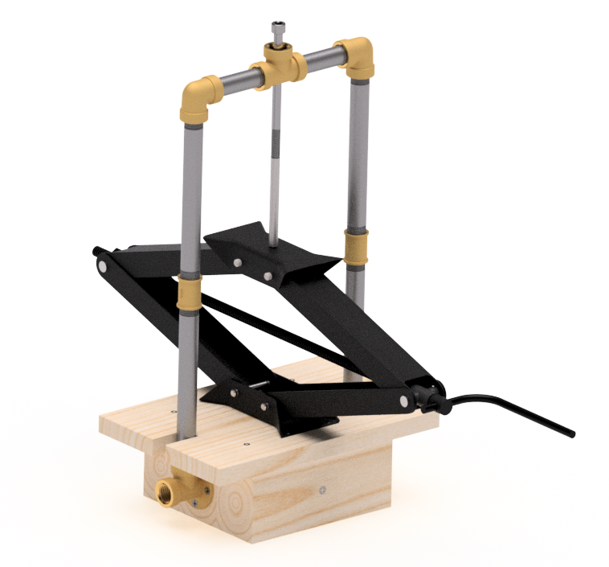

Une injecteuse manuelle est un appareil permettant de transformer le plastique fondu en pièces moulées. Elle fonctionne en injectant le plastique chauffé dans un moule à l'aide d'une pression manuelle. Ce processus est essentiel pour la fabrication de nouveaux objets à partir de plastique recyclé.

Guide détaillé : <https://hub.antenna.ch/node/91>

### **Cartouches métalliques pour injection**

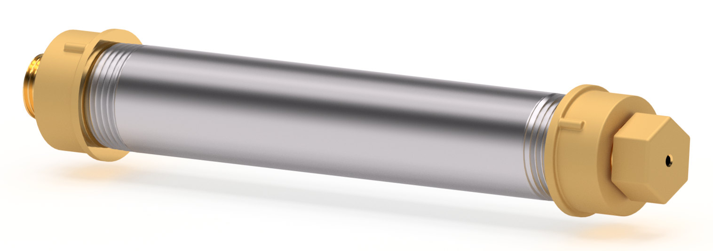

Les cartouches métalliques sont des contenants utilisés pour stocker le plastique fondu avant l'injection dans le moule. Elles sont conçues pour résister à des températures élevées et faciliter le transfert du plastique fondu.

Guide détaillé : <https://hub.antenna.ch/node/92>

### **Kit Portable de recyclage plastique solaire**

Un kit complet comprend tous les équipements nécessaires pour le recyclage solaire des plastiques : concentrateur solaire, injecteuse manuelle, moules, et outils divers. Il est conçu pour faciliter la mise en place d'une station de recyclage autonome.

Guide détaillé : <https://hub.antenna.ch/node/95>

---

## Emplacement nécessaire

L’utilisation de l’énergie solaire nécessite un lieu adéquat afin de maximiser l’énergie absorbée dans le processus. Un lieu avec dégagement total est idéal.   

Sur terre le soleil apporte une énergie solaire variable entre 500 et 2’500 kWh par mètre carré, sa puissance et le temps de lumière par jour dépendent de votre situation géographique.  

   *Variation de la radiation annuelle mondiale \[de 500 à 2500 kWh/m²\].*

*source : https://solargis.info*

Le recyclage plastique à l'énergie solaire peut se pratiquer sur toutes les parties du globe. La variation de puissance à un effet sur la capacité de production et non sur la faisabilité.

Pour une unité de production, le lieu d’implantation nécessite un espace d'environ 60 m².

**Ce caractéristiques s'appliquent à une station de production fixe.**

## Capacité de production

La capacité de production dépend directement de la puissance solaire qui varie annuellement et de manière journalière en fonction de l'emplacement géographique. La déclinaison solaire varie directement la puissance et la durée des journées de production.

  

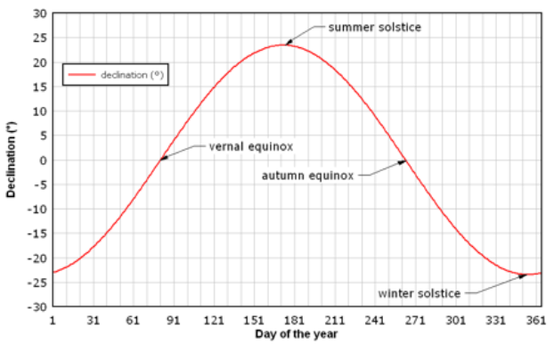

 *Déclinaison solaire annuelle.*

La production annuelle d’un kit portable peut produire jusqu’à 1’300 objects avec un volume n'excédant pas les 50’000 mm³ (0,5 dL). Il est possible de réaliser des objets plus volumineux pour une production inférieure avec des machines adaptées.

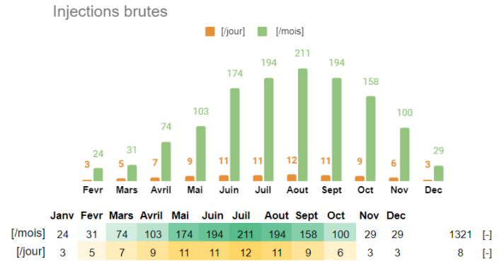

*Exemple de production annuelle pour un kit, aux Portugal \[40° 38′ 28″ Nord, 8° 39′ 13″ Ouest\].*

Pour connaître la production d’une centrale, la quantité du kit portable est à multiplier par le nombre de postes installés.

# Objets recyclés au solaire thermique

## Objets réalisés à ce jour

Les exemples ci-dessous de production en injection plastique solaire, sont des cas concrets déjà réalisés en collaboration avec différents partenaires.

**Poignée de meuble**

La poignée de meuble fut le premier objet au monde réalisé objet par le procédé d’injection plastique solaire.

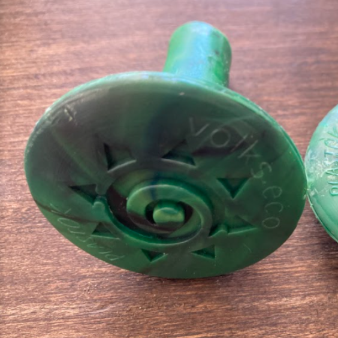

 *Poignée de meuble réalisée par [__PlastOk__](https://www.instagram.com/plastok_geneva/) et [__volks.eco__](http://volks.eco) à Genève. ([__vidéo de réalisation__](https://youtu.be/4LCbm_M_BW0))*

**Lunettes de soleil**

En collaboration avec un producteur de lunettes de soleil portugais des montures ont été réalisées avec diverses matières premières.

1: PPE (masques anti-covid), 2 : Polymère bio de chanvre (Bio-plastique) 3: HDPE (Bouchons de bouteille, shampoings, crèmes, etc.) 4: PP (boîtes pour aliments) 

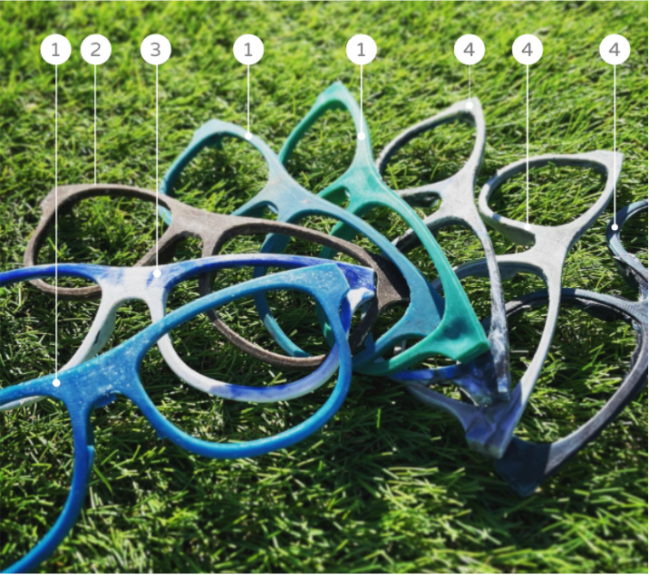

*Faces de lunettes réalisées par [__LiquenEyeWear__](https://www.instagram.com/liqueneyewear/).*

 *Lunettes de soleil réalisées par [__LiquenEyeWear__](https://www.instagram.com/liqueneyewear/) à partir de bouchons de bouteille.*

**Ouvre bouteilles**

Dans le cadre de nouveaux tests, un décapsuleur de bouteille à été réalisé avec plusieurs matières plastiques ayant une pièce de monnaie insérée dans le moule d’injection.

   

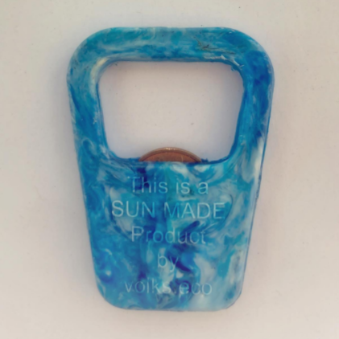

 *Décapsuleurs réalisés par [volks.eco](https://volks.eco)*

## Idées d’objets à réaliser

Pour l’instant, les objets réalisés en plastique recyclé solaire DIY sont de petite taille, mais avec l’évolution de la technologie, il sera possible de créer des objets plus grands et plus complexes.

| Catégorie                 | Symboles / Icônes | Exemples d’objets                                                                              |
|---------------------------|-------------------|------------------------------------------------------------------------------------------------|
| **Bijoux**                    | 💍📿              | Boucles d’oreille, Bracelets, Colliers                                                         |
| **Accessoires**               | 👕🔑📎            | Boutons vestimentaires, Peignes, Boucles de ceinture, Porte-clés, Stylos, Support de téléphone |
| **Outils**                    | 🛠️🔧             | Tournevis, Couteaux, Clés USB                                                                  |
| **Construction / Décoration** | 🏠🧱              | Dalles de décoration, Prises électriques                                                       |

---

# Contact

## **Sites principaux**

Pour toute information sur le **recyclage plastique solaire**, les kits DIY et les machines Sun Factory :

- **Liens**
  - [hub.antenna.ch](http://hub.antenna.ch)
  - [sunfactory.world](http://sunfactory.world)
- **Emails :** 
  - [marco@volks.eco](mailto:marco@volks.eco)
  - <https://antenna.ch/contact>

---

# Partenariats et diffusion

## **Sun Factory Project**

**Sun Factory Project** s’appuie sur un réseau solide de partenaires et intervenants, garantissant que le recyclage solaire du plastique est **fonctionnel et reconnu** :

- **Présentations de Sun Factory Project :**
  -  [2025](https://volkseco.github.io/SunFactoryPres2025/#RoadMap) ([https://volkseco.github.io/SunFactoryPres2025/](https://volkseco.github.io/SunFactoryPres2025/#RoadMap))
    - *les liens sont fonctionnels sur ordinateur et non sur smartphone.*
- **Plateformes et communautés :**
  - [Antenna.ch](http://Antenna.ch)
  - [Distributed Design Europe](https://distributeddesign.eu/?utm_source=chatgpt.com)
  - [Open Business World](https://openbusiness.world/?utm_source=chatgpt.com)
- **Institutions et laboratoires :**
  - Institut polytechnique de Lisbonne ([ESELX](https://www.eselx.ipl.pt/node/624?utm_source=chatgpt.com))
  - FabLab Benfica ([Fablab](https://fablabbenfica.pt/opencallDDP2025/?utm_source=chatgpt.com))
  - HappyLab ([News et workshops](https://www.happylab.at/en_vie/news/ws-091024?utm_source=chatgpt.com))
- **Entreprises et initiatives pilotes :**
  - [PlastOK.ch](http://PlastOK.ch)
  - [volks.eco](https://volkseco.ch/?utm_source=chatgpt.com)
  - [Ecoboost.world](http://Ecoboost.world)
  - [MakeWake](https://makewake.ch/?utm_source=chatgpt.com)
- **Événements et démonstrations :**
  - [Maker Faire – 2023](https://makerfaire.com/yearbook/projects/reciclagem-de-plastico-com-energia-solar-termica-2023/?utm_source=chatgpt.com)
  - [Gliding Barnacles – Site Officiel](https://glidingbarnacles.pt/?utm_source=chatgpt.com)
  - [Happy Market](https://www.facebook.com/events/%C3%8Elot-13/happy-market/1527047527620073/?utm_source=chatgpt.com)
  - [Catraia](https://www.catraia.pt/?utm_source=chatgpt.com)

**Objectifs commun :**

**Diffuser la technologie, favoriser les initiatives DIY et soutenir la production de plastique recyclé solaire à petite et grande échelle.**